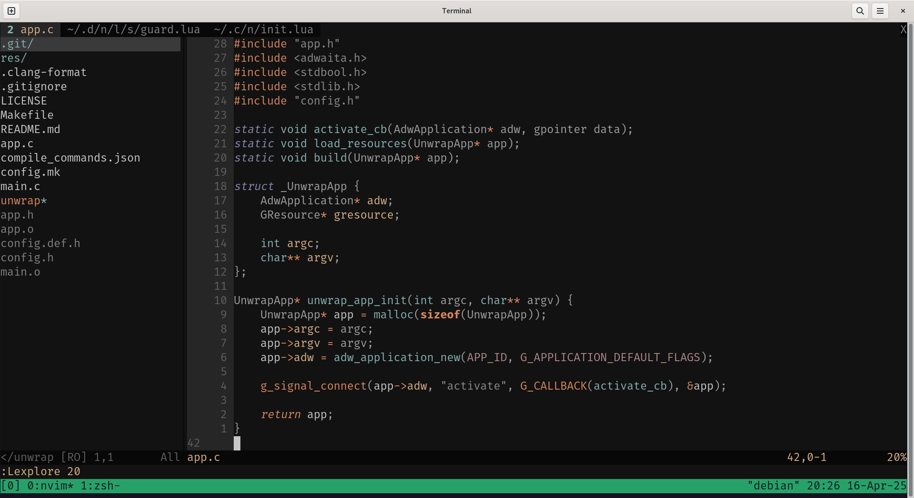

# Dotfiles

My personal dotfiles for Linux installations.



## Installation

### Downloading

```
git clone https://github.com/potatowizard23/dotfiles ~/.dots
```

### Install dotfiles

You will need to have `git` and `stow` installed.

```
git clone https://github.com/potatowizard23/dotfiles ~/.dots
cd ~/.dots
stow .
```

### Uninstall dotfiles 

```
stow -D .
rm -rf ~/.dots
```
